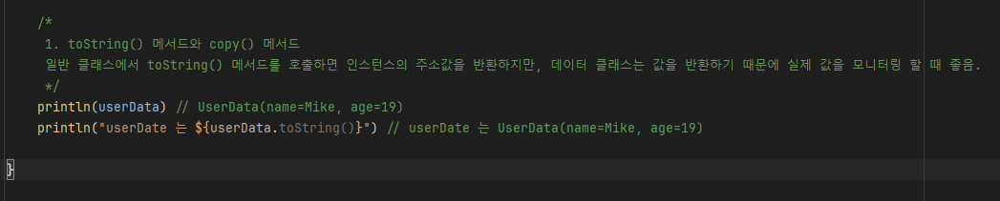
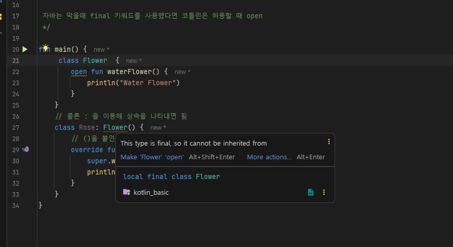
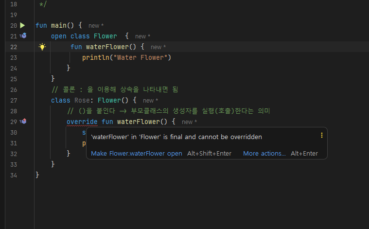

## 데이터 클래스 (Data Class)

코틀린은 간단한 데이터의 저장용도로 `data class`를 제공합니다. 이러한 데이터 클래스는 자바의 POJO와 유사하며, 주로 데이터를 보관하는 데 사용됩니다.


### 데이터 클래스의 정의
데이터 클래스를 정의할 때는 `class` 앞에 `data` 키워드를 사용하며, 생성자의 파라미터 앞에 `var` 또는 `val` 키워드를 생략할 수 없습니다.

```kotlin
data class UserData(val name: String, var age: Int)
```

생성하는 코드는 일반 클래스와 동일하게 작성.

> 메서드 활용 목적보다는 데이터 저장 목적으로 사용하는 클래스임

### 주요 기능
- **자동 생성 기능**: `data class`로 정의된 클래스는 `equals()`, `hashCode()`, `toString()`, `copy()` 등의 메서드가 자동으로 생성됩니다.
- **`toString()` 메서드**: 데이터 클래스의 인스턴스를 문자열로 표현할 때, 인스턴스의 속성 값들을 쉽게 볼 수 있게 출력해 줍니다.
- **`copy()` 메서드**: 객체의 복사본을 생성할 때 원본 객체의 일부 속성만 변경하여 새 객체를 생성할 수 있습니다.


#### 사용

#### 데이터 클래스 정의
```kotlin
fun main() {
    // 정의 - 주로 코드 블록(클래스 스코프)을 사용하지 않고 간단하게 작성.
    data class UserData(val name: String, val age: Int)
}
```

#### 객체 생성
데이터 클래스의 인스턴스는 일반 클래스와 동일하게 생성자를 호출하여 생성합니다.
```kotlin
val userData = UserData(name = "Mike", age = 10)
```

#### 데이터 클래스 정의 & 객체 생성

```kotlin
fun main() {
    // 정의 - 주로 코드 블록(클래스 스코프)을 사용하지 않고 간단하게 작성.
    data class UserData(val name: String, val age: Int)
    
    // 생성 - 일반 class 의 생성자 함수를 호출하는 것과 동일
    val userData = UserData(name = "Mike", age = 10)
}
```

#### 속성 변경 
`var`로 선언된 속성은 수정할 수 있습니다. `val`로 선언된 속성은 읽기 전용입니다.

```kotlin
fun main() {
    data class UserData(val name: String, var age: Int)

    val userData = UserData(name = "Mike", age = 10)

//    userData.name = "sindy"

    userData.age  = 19
}
```
여기서 부분이 속성 변경
```kotlin
userData.age = 19
```


#### `toString()` 메서드 (출력)
자동 생성된 `toString()` 메서드를 통해 객체의 상태를 쉽게 확인할 수 있습니다.
    일반 클래스에서 toString() 메서드를 호출하면 인스턴스의 주소값을 반환하지만, 데이터 클래스는 값을 반환하기 때문에 실제 값을 모니터링 할 때 좋음.

    val : getter 만 제공
    var : getter / setter 제공
 

```kotlin
fun main() {
    data class UserData(val name: String, var age: Int)

    val userData = UserData(name = "Mike", age = 10)


    userData.age = 19

    println(userData)  // 출력: UserData(name=Mike, age=19)
    println("userDate 는 ${userData.toString()}") // userDate 는 UserData(name=Mike, age=19)
}
```

<p align="center">
 
</p>

#### `copy()` 메서드
객체의 복사본을 만들면서 특정 속성만 변경할 수 있습니다.


```kotlin
fun main() {

    data class UserData(val name: String, var age: Int)
    val userData = UserData(name = "Mike", age = 10)


    userData.age = 19


    println(userData) // UserData(name=Mike, age=19)
    println("userDate 는 ${userData.toString()}") // userDate 는 UserData(name=Mike, age=19)

    /*
     또, copy() 메서드로 간단하게 값을 복사할 수 있음.
     */
    var newData : UserData? = userData.copy()
    println(newData) // UserData(name=Mike, age=19)
}
```
```kotlin
val updatedUserData = userData.copy(age = 20)
println(updatedUserData)  // 출력: UserData(name=Mike, age=20)
```

### Java에서의 유사 구현
자바에서는 데이터 클래스와 유사한 기능을 구현하기 위해 getter와 setter 메서드를 명시적으로 작성해야 합니다. 또한, `toString()` 메서드도 오버라이드해야 합니다.

```java
public class UserData {
    private String name;
    private int age;

    public UserData(String name, int age) {
        this.name = name;
        this.age = age;
    }

    public String getName() {
        return name;
    }

    public void setName(String name) {
        this.name = name;
    }

    public int getAge() {
        return age;
    }

    public void setAge(int age) {
        this.age = age;
    }

    @Override
    public String toString() {
        return "UserData{" +
                "name='" + name + '\'' +
                ", age=" + age +
                '}';
    }
}
```


코틀린의 데이터 클래스는 코드를 간결하게 만들고, 자동으로 많은 보일러플레이트 코드를 처리해 줍니다. 

이처럼 클래스와 사용법이 동일하지만 주로 네트워크를 통해 데이터를 주고 받거나, 혹은 로컬 앱의 데이터베이스에서 데이터를 다루기 위한 용도로 주로 사용.<br>

> e.g ) 네트워크에서 json 으로 데이터를 주고 받는데 json 데이터를 코틀린환경에서 주고 받고자 할 때, 데이터 클래스에서 저장함

아래는 코틀린에서 데이터 클래스를 사용하는 예제와 관련 설명을 마크다운 문법으로 깔끔하게 정리한 내용입니다.

---

## 데이터 클래스 연습

코틀린의 `data class`를 사용하여 메모 애플리케이션을 예로 든 간단한 연습입니다. 데이터 클래스는 객체를 위한 `toString()`, `copy()` 같은 메서드를 자동으로 제공하며, 이를 통해 코드를 간결하게 유지하고, 객체의 복사 및 출력을 쉽게 할 수 있습니다.

### 예제 코드

#### 초기 객체 생성 및 출력

```kotlin
data class Memo(val title: String, val content: String, var isDone: Boolean)

val memo1 = Memo("마트 가기", "계란,우유,빵", false)

println(memo1) // 출력: Memo(title=마트 가기, content=계란,우유,빵, isDone=false)
```

여기서 `Memo` 클래스는 쇼핑 목록을 나타내는 간단한 데이터 저장용 클래스<br>
`println` 함수를 사용하면, `data class`로 정의된 `Memo` 객체의 `toString()` 메서드가 자동으로 호출되어 객체의 내용이 잘 포맷된 문자열로 출력됩니다.

#### 객체의 속성 변경 및 복사

`copy()` 메서드를 사용하여 객체의 특정 속성만을 변경한 새 객체를 생성할 수 있습니다.

```kotlin
val memo2 = memo1.copy(content = "칫솔, 과자, 담배") // content 속성만 변경하여 새 객체 생성
println(memo1.toString()) // 출력: Memo(title=마트 가기, content=계란,우유,빵, isDone=false)

println(memo2.toString()) // 출력: Memo(title=마트 가기, content=칫솔, 과자, 담배, isDone=false)
```

여기서 `memo1` 객체의 `content` 속성만 변경된 새로운 `memo2` 객체가 생성되었습니다. 이 기능은 변경 불가능한(immutable) 속성을 가진 객체를 다룰 때 유용하며, 원본 객체는 그대로 유지되고 새로운 속성 값으로 새 객체를 생성할 수 있습니다.

### 메서드 설명

- **`toString()`**: 데이터 클래스 인스턴스의 내부 프로퍼티를 문자열로 변환하여 반환합니다. 이 메서드는 데이터 클래스에 자동으로 생성되며, 생성자에 포함된 모든 프로퍼티를 포함한 문자열을 출력합니다.
- **`copy()`**: 기존 객체를 기반으로 새 객체를 생성하면서, 필요한 속성만 변경할 수 있습니다. 이 메서드는 데이터 클래스에 자동으로 제공되며, 객체의 불변성을 유지하면서 새로운 버전의 객체를 쉽게 생성할 수 있는 방법을 제공합니다.

데이터 클래스는 주로 네트워크 통신이나 데이터베이스와의 상호작용에서 모델 클래스로 활용됩니다.

---

아래는 코틀린의 접근 제한자에 대한 설명을 마크다운 문법으로 정리한 문서입니다. 이 문서는 클래스의 멤버에 적용할 수 있는 접근 제한자와 그 범위를 설명합니다.

## 접근 제한자 (Access Modifiers)

접근 제한자는 클래스의 메서드와 변수가 어디에서 접근 가능한지를 정의합니다. 코틀린에서는 여러 접근 제한자를 사용하여 클래스의 캡슐화를 관리할 수 있습니다.

### 접근 제한자의 종류

코틀린에서 사용할 수 있는 주요 접근 제한자는 다음과 같습니다:

#### `public`
- **범위**: 어디서나 접근 가능
- **기본값**: 코틀린에서 클래스의 속성과 메서드에는 기본적으로 `public` 접근 제한자가 적용됩니다.

#### `private`
- **범위**: 해당 클래스 내부에서만 접근할 수 있음.
- **사용 예**: 클래스의 내부 구현을 숨기고 싶을 때 사용합니다.

#### `protected`
- **범위**: 해당 클래스와 그 자식 클래스에서 접근할 수 있음.
- **사용 예**: 상속받은 클래스에서만 사용해야 하는 멤버에 적용합니다.

#### `internal`
- **범위**: 같은 모듈 내에서 접근 가능.
- **사용 예**: 안드로이드 개발에서 한 프로젝트 내 모듈 간에는 접근이 가능하지만, 다른 프로젝트에서는 접근할 수 없도록 할 때 사용합니다.

### 자바와의 차이점
자바에서는 `default` 접근 제한자(패키지 프라이빗)가 있어 같은 패키지 내의 클래스에서만 접근할 수 있습니다. 하지만 코틀린에는 `default` 접근 제한자가 없으며, 가장 가까운 것이 `internal` 제한자입니다.

### 예제

```kotlin
class Example {
    public val publicProperty = "Accessible anywhere"
    private val privateProperty = "Accessible within this class only"
    protected val protectedProperty = "Accessible in this class and its subclasses"
    internal val internalProperty = "Accessible within the same module"

    private fun privateMethod() {
        println("This is a private method.")
    }

    protected open fun protectedMethod() {
        println("This is a protected method.")
    }

    internal fun internalMethod() {
        println("This is an internal method accessible within the same module.")
    }

    fun publicMethod() {
        println("This is a public method accessible from anywhere.")
    }
}
```


---

## 코틀린에서의 클래스 상속

코틀린에서 클래스를 상속받기 위해서는 부모 클래스에 `open` 키워드를 추가해야 합니다. 자바와 달리, 코틀린에서는 기본적으로 클래스가 상속 불가능(`final`) 상태이기 때문에, 상속을 허용하려면 명시적으로 `open`을 사용해야 합니다.

### 상속의 기본

상속을 가능하게 하려면 클래스 뿐만 아니라 오버라이드하려는 메서드에도 `open` 키워드를 사용해야 합니다.


```kotlin
fun main() {
    open class Flower { // 상속 가능하도록 open 사용
        open fun waterFlower() { // 오버라이드 가능하도록 open 사용
            println("Water Flower")
        }
    }
    // 콜론 : 을 이용해 상속을 나타내면 됨
    class Rose: Flower() { // Flower을 상속받은 클래스
        // ()을 붙인다 -> 부모클래스의 생성자를 실행(호출)한다는 의미
        override fun waterFlower() { // 부모 클래스 메서드 오버라이딩
            super.waterFlower()
            println("Rose is water flower")
        }
    }
    val rose = Rose()
    rose.waterFlower() // 오버라이딩된 메서드 호출
    // 출력:
    // Water Flower
    // Rose is a water flower
}
```


#### `open`을 사용하지 않았을 때
`open` 키워드가 없으면 클래스와 메서드는 `final`로 간주되어 상속이나 오버라이딩이 불가능

이러한 시도를 하면 컴파일 에러가 발생합

<p align="center">
 
</p>

메서드의 기본형태가 `final` 라서 에러 발생

<p align="center">
 
</p>


---

### 추상 클래스

추상 클래스는 `abstract` 키워드를 사용하여 선언되며, 직접 인스턴스를 생성할 수 없음.<br>
추상 클래스는 구현되지 않은 추상 메서드를 포함할 수 있으며, 이 메서드들은 자식 클래스에서 구현되어야 합니다.

#### 주요 특징
- 추상 클래스는 추상 메서드 뿐만 아니라 구현된 메서드도 포함할 수 있습니다.
- 추상 메서드는 본문이 없으며, 모든 자식 클래스에서 이를 구현해야 합니다.
- 특정 메서드의 구현을 강제하려고 할 때 추상 클래스를 사용합니다.

    추상 클래스는 그 자체로는 객체를 만들 수 없는 클래스로, 일반적으로 추상 메서드가 포함된 클래스를 말함.

추상 메서드란 아직 구현되지 않고 **추상적으로만 존재하는 메서드**.

    추상 클래스 자체로는 직접 객체를 만들 수 없고 자식 클래스에서 추상 메서드를 구현한 다음,
    자식 클래스의 객체를 생성하면 됨.

```kotlin
abstract class Game {
    fun startGame() {
        println("게임을 시작했습니다.") // 구현된 메서드
    }

    // 추상 메서드
    // 추상 메서드는 {} 블록 사용할 필요가 없다
    abstract fun printName() // 추상 메서드
}

class OverWatch : Game() {
    override fun printName() { // 추상 메서드 구현
        println("오버워치입니다.")
    }

}

fun main() {
    val overWatch = OverWatch()
    overwatch.startGame() // 구현된 메서드 호출
    overwatch.printName() // 구현된 추상 메서드 호출
    // 출력:
    // 게임을 시작했습니다.
    // 오버워치입니다.
}
```

#### 추상 클래스 사용 이유
- **구현 강제**: 추상 클래스는 서브 클래스가 특정 메서드를 반드시 구현하도록 강제하는 데 사용됩니다. 이는 서브 클래스가 일관된 구조를 유지하도록 도와줍니다.

#### 코틀린이 `final` 대신 `open`을 사용하는 이유
코틀린은 상속과 오버라이딩을 보다 의도적이고 통제된 방식으로 사용하게 하기 위해 `open` 키워드를 도입했습니다. 기본적으로 클래스와 메서드를 `final`로 설정함으로써, 의도하지 않은 상속이나 오버라이딩을 방지하고 더 견고하고 오류가 적은 코드를 작성할 수 있도록 합니다.